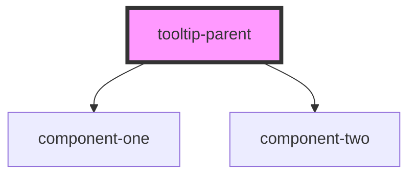

# tooltip-parent

<!-- Auto Generated Below -->

## Properties

| Property | Attribute | Description | Type     | Default     |
| -------- | --------- | ----------- | -------- | ----------- |
| `color`  | `color`   |             | `string` | `undefined` |

## Dependencies

### Depends on

- [component-one](../component-one)
- [component-two](../component-two)

### Graph

----------------------------------------------

*Built with [StencilJS](https://stenciljs.com/)*
